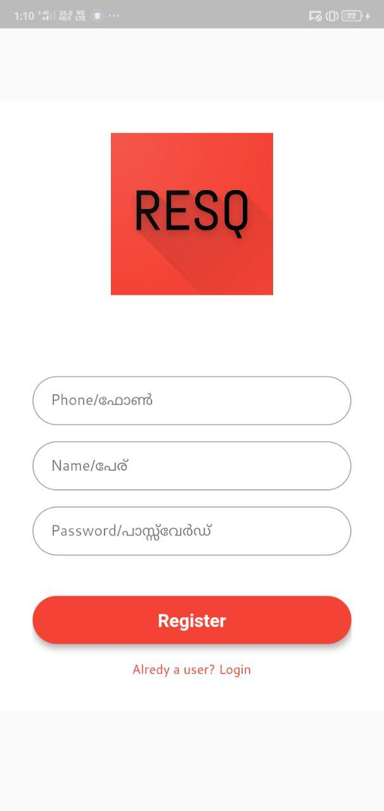
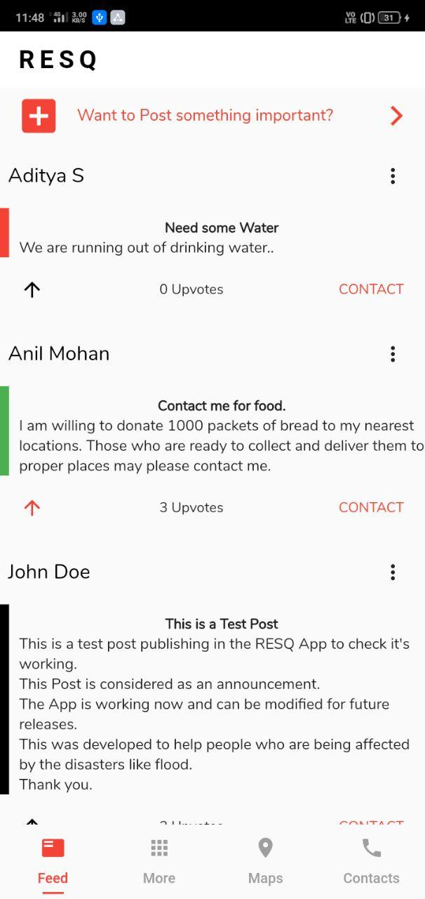
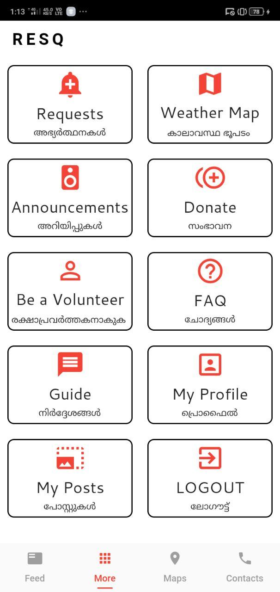
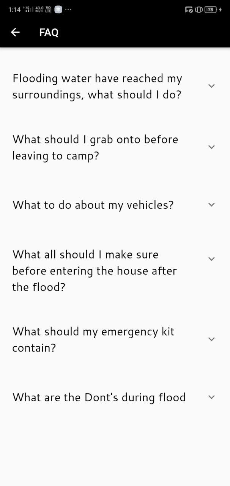
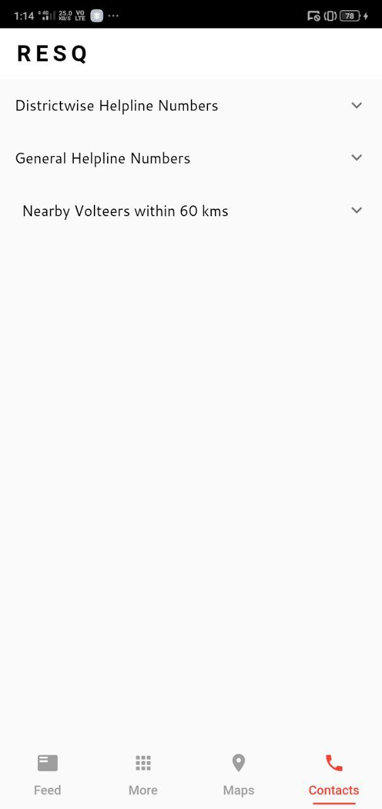
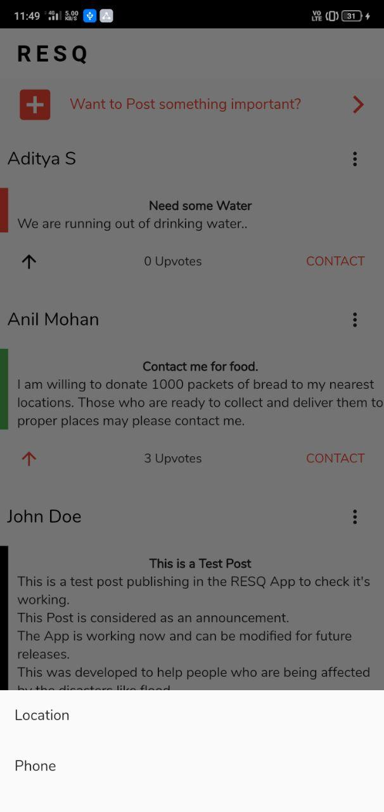
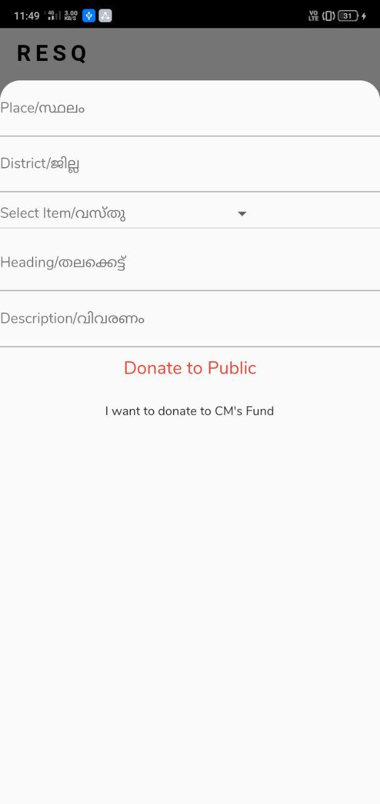
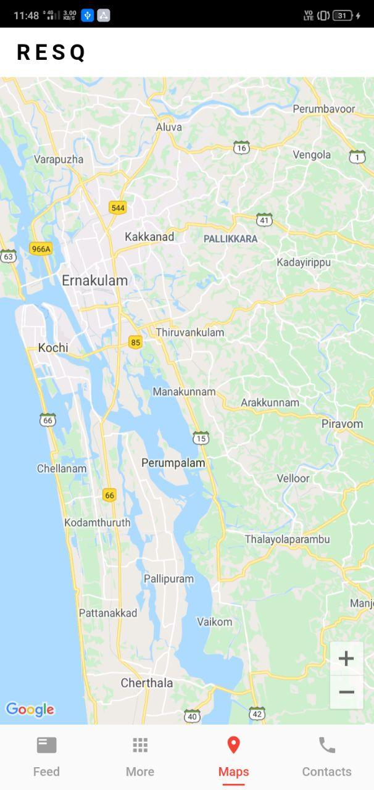

# ResQ
## A socially responsible Flutter App


ResQ is a socially responsible Flutter Application which can work both on android and iOS.
It is designed for assistance in scenarious of natural disasters like flood.


[ The app is currently designed in English and Malayalam (Regional language of Kerala, a recent flood affected area) which can be updated to work on any regional languages. ]


### Highlights
- The Emergency UI makes it easy to use.
- It connects the victims and rescuers at the same platform.
- It completely works based on the accurate location of users.
- The User can:
  - Request Help.
  - Donate to public as well as to CM's Fund.
  - Be a volunteer by filling a simple form and can withdraw anytime.
- FAQ and GUIDE section for the do's and dont's during the disaster periods.
- Map page shows the markers for people who request help. (Currently under development).
- Contacts page gives the important contact number and the contact details of volunteers registered within 60 kms.

### Features

- The Home Page contains the Posts by users.
  - It may be posts by people trapped on different locations due to the disaster. (Displayed with RED margin).
  - It may be posts by people willing to help offering help to the victims. (Displayed with GREEN margin).
  - It may be announcements from officails or non-officials which are important for the users. (Displayed with BLACK margin).
- Every Post has a CONTACT button to it's bottom right which allows the user to contact the person who posted the POST.
  - It pops up 2 options:
    - Phone - It redirects the user to the dialpad with the phone number dialed.
    - Location - It redirects the user to the google maps with destination set to the location of  the person who posted it.
- Every one who views the post have the ability to upvote the posts.This enables the rescuers to find out the valid post and spam post.
- User have the ability to delete the post posted anytime anywhere.
- The weather map gives the live update of weather.
- FAQ and GUIDE section for the do's and dont's during the disaster periods.
- Map page shows the markers for people who request help. (Currently under development).
- Contacts page gives the important contact number and the contact details of volunteers registered within 60 kms.


[GitHub Repo for Fronend](https://github.com/allenjiji/ResQ/)


[GitHub Repo for Backend](https://github.com/anandhakrishnanaji/RESQ-Backend/)


[View Website for ResQ](https://allenjiji.github.io/ResQ/)


### Tech 

* [Flutter] - For Front End Development
* [Django Rest Framework] - For Backend Operations

### Installation for Developers


After installing Flutter on PC:

For front-end of the app.
```sh
$ git clone https://github.com/allenjiji/ResQ
$ flutter pub get
$ flutter run
```

For Back-end of the app.
```sh
$ git clone https://github.com/anandhakrishnanaji/RESQ-Backend
```
<!-- [](https://allenjiji.github.io/ResQ/ResQ.apk) -->

## Screenshots

<p align="center">
  
  
  
  
  
  
  
  
  
  
  
</p>  


# Download APK Now!

For Android : [Download v1.0 (19.0 mb)](https://github.com/allenjiji/ResQ/releases/download/v1.0/ResQ.apk)


   [git-repo-url]: <https://github.com/joemccann/dillinger.git>
   [Django Rest Framework]: <https://www.django-rest-framework.org/>
   [Flutter]: <https://flutter.dev/>
 
